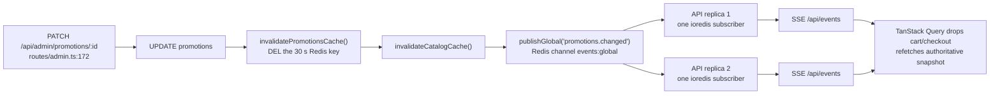

# Adaptability — what changes when the requirements change

The assignment names five follow-up changes: higher concurrency, a different AI provider, PSTN access, stricter privacy, and changes to the live-session discount and checkout rules. This document is the actionable expansion of the plan's **Adaptability seams** table: for each one, what the customer actually asks for, the exact files / env vars / tables / endpoints involved, **what does not change**, and how to show it in under two minutes.

The design rule behind all five: a requirement change should land in this order of preference — **(1) a row in a table, (2) an environment variable, (3) a new implementation of an interface that already has ≥2 implementations, (4) new code.** Only PSTN reaches level 4, and it reaches it by adding one edge, not by touching the middle.

| Change                    | Blast radius                                                                                      | Redeploy?             |
| ------------------------- | ------------------------------------------------------------------------------------------------- | --------------------- |
| Discount / checkout rules | `promotions` / `checkout_policies` row via two `PATCH` endpoints                                  | No — **observed**, §5 |
| Higher concurrency        | 6 env vars + replica count; Agora quota tickets are the real gate                                 | Restart only          |
| Different AI provider     | `LLM_PROVIDER` / `LLM_BASE_URL` / `LLM_MODEL` / `LLM_API_KEY`, or one new file in `ai/providers/` | Restart only          |
| Stricter privacy          | `PRIVACY_MODE`, `PII_REDACTION`, three retention vars, `CONVOAI_GEOFENCE_AREA`                    | Restart only          |
| PSTN access               | Two new components at the edge; **not built** — no number, no SIP trunk                           | New code              |

---

## 1. Higher concurrency

**What the customer asks for.** "Big Billion Days. The 200-viewer session becomes 200,000, and we want 500 concurrent AI conversations, not 15."

### The quota tickets come first

The knobs below are all raisable in seconds; the Agora account defaults are not. Raising `CONVOAI_MAX_CONCURRENT_AGENTS` past 20 without a support ticket buys nothing but `422 ResourceQuotaLimitExceeded`. **File these before touching config:**

| Order | Agora quota                          | Default              | Gates                                                                                                                                    |
| ----- | ------------------------------------ | -------------------- | ---------------------------------------------------------------------------------------------------------------------------------------- |
| 1     | ConvoAI concurrent agents per App ID | 20 PCU               | `CONVOAI_MAX_CONCURRENT_AGENTS` — one agent serves exactly one viewer, so this _is_ the concurrent-AI-conversation ceiling               |
| 2     | Signaling REST requests per App ID   | 500 req/s            | Server-authored chat fan-out; `agora/signaling.ts` paces itself against `PUBLISH_BUDGET_PER_SECOND = 500` so no caller can burst past it |
| 3     | Project regional PCU / bandwidth     | 10,000 PCU / 10 Gbps | The real RTC→CDN offload trigger, not the 1 M-per-channel ceiling                                                                        |
| 4     | Cloud Recording concurrent workers   | 50 PCW               | Only if every session is recorded server-side; the demo path uses browser `MediaRecorder`                                                |

Sizing arithmetic, per-tier cost and the load-test evidence live in **`docs/scale-and-capacity.md`** — not restated here.

### Then the knobs, in this order

All six are parsed in `apps/server/src/env.ts` and read exactly once per process at boot.

| #   | Env var                                                 | Default            | Where it bites                                                              | Why this position in the order                                                                                                                                                                                                                                                                                                    |
| --- | ------------------------------------------------------- | ------------------ | --------------------------------------------------------------------------- | --------------------------------------------------------------------------------------------------------------------------------------------------------------------------------------------------------------------------------------------------------------------------------------------------------------------------------- |
| 1   | `PG_POOL_MAX`                                           | 20                 | `db/client.ts:9` (`pg` pool `max`)                                          | Raise **first**. Every other knob increases request concurrency, and a starved pool turns extra load into connection-timeout errors that look like application bugs.                                                                                                                                                              |
| 2   | `ANALYTICS_DRAIN_BATCH` / `ANALYTICS_DRAIN_INTERVAL_MS` | 500 / 250 ms       | `background.ts:118`, `background.ts:392`                                    | 500 rows / 250 ms ≈ 2,000 rows/s. Raise **before** viewer count, because `analytics_stream_backlog` growing without bound is the first thing that breaks under real traffic, and it breaks silently.                                                                                                                              |
| 3   | `RTM_CHAT_SHARD_TARGET`                                 | 2                  | `domain/sessions.ts:427`, `db/seed.ts:50`                                   | `chatShardCount = clamp(ceil(expectedPeakViewers / target), 1, 49)`. Demo value is 2 so three tabs shard visibly; production wants ~1,000+. **Frozen at the `scheduled → live` transition** (decision 12), so changing it affects _future_ sessions only — a live session keeps its modulus and nobody gets re-routed mid-stream. |
| 4   | `RTC_TIER_MAX_VIEWERS`                                  | 3                  | `domain/sessions.ts:601`                                                    | The one-way `rtc → cdn` flip. Demo value is 3 so the transition is reachable with three tabs; production is a real number near the interactive-tier budget. Never flips back within a session.                                                                                                                                    |
| 5   | `CONVOAI_MAX_CONCURRENT_AGENTS`                         | 15                 | `ai/admission.ts` (Redis `ZADD`-under-`ZCARD` Lua semaphore on `ai:agents`) | Raise **only after** the ConvoAI ticket clears. Set below the granted quota, not equal to it — the lease TTL is `CONVOAI_IDLE_TIMEOUT_SECONDS + 60`, so reclaim lags a crashed client slightly.                                                                                                                                   |
| 6   | replica count                                           | 2 (`api1`, `api2`) | `infra/docker-compose.yml`, `infra/nginx.conf:27-29`                        | Last, because it is the only one that costs money linearly and the only one that is genuinely free of correctness risk.                                                                                                                                                                                                           |

### What does NOT change

- **Nothing about correctness.** No lock, no read-then-write, no per-replica state. Stock decrements are atomic `UPDATE … WHERE stock >= $qty RETURNING`; sessions live in Redis; recordings live on a shared volume.
- **The background process stays a single instance.** It is the sole owner of every timer and every stream consumer (`background.ts:27-48`), which is what stops two replicas double-emitting a 1 Hz aggregate. Scaling the API tier does _not_ mean scaling this one — the singleton is the deliberate carve-out written into decision 9, not an oversight in it.
- **`RTM_CHAT_SHARD_TARGET` and `RTC_TIER_MAX_VIEWERS` are not hot-reloadable and must not be.** Both feed frozen or one-way session state. Restarting with a new value is correct; mutating a live session's shard count would silently re-route users.

### Two-minute demo

1. `GET /metrics` → point at `ai_agent_slots_in_use`, `analytics_stream_backlog`, `sse_clients` (all from `lib/metrics.ts`).
2. Open a third live tab with `RTC_TIER_MAX_VIEWERS=3` → the `session.delivery_tier_changed` event fires once and every audience client starts HLS _before_ leaving the RTC channel. This is the mass-tier switch working at demo scale, and it is the same code path at 200,000.
3. Open AI conversations until admission refuses → `503 ai_capacity` with `retryAfterSeconds`, and the client degrades to the labelled text transport rather than dead-ending. Raise `CONVOAI_MAX_CONCURRENT_AGENTS`, restart, repeat.

---

## 2. A different AI provider

**What the customer asks for.** "We have an enterprise OpenAI contract / we're standardising on Azure / legal wants a self-hosted vLLM in our own VPC."

### The seam

`apps/server/src/ai/providers/index.ts` is a registry behind a two-member interface:

```ts
export interface LlmProvider {
  readonly id: string;
  streamChat(req: LlmRequest): AsyncIterable<LlmChunk>;
}
```

Three real implementations, none of them a stub:

| id                  | File                            | What it is for                                                                                                                                                                                                                                                                                                      |
| ------------------- | ------------------------------- | ------------------------------------------------------------------------------------------------------------------------------------------------------------------------------------------------------------------------------------------------------------------------------------------------------------------- |
| `openrouter`        | `providers/openrouter.ts`       | Default; the only one exercised against real credentials. Adds OpenRouter's documented deviations to the shared reader: `: OPENROUTER PROCESSING` keepalives skipped, `ignoreTrailingUsageFinish: true` for the usage chunk that repeats `finish_reason`, HTTP-200 mid-stream `error` raised as a provider failure. |
| `openai-compatible` | `providers/openaiCompatible.ts` | OpenAI direct, Groq, Together, Azure, self-hosted vLLM — **selected purely by `LLM_BASE_URL`**. Owns `streamOpenAiSse`, the SSE framer every HTTP provider shares.                                                                                                                                                  |
| `mock`              | `providers/mock.ts`             | Deterministic. Selected by the automated checks and the k6 `ai-proxy` scenario so proxy overhead is measurable without model latency, and so fragmented tool calls and callback replay are reproducible.                                                                                                            |

For OpenAI direct, Groq, Together, Azure or vLLM there is **no new code at all** — four env vars:

```
LLM_PROVIDER=openai-compatible
LLM_BASE_URL=https://api.openai.com/v1
LLM_MODEL=gpt-4o-mini
LLM_API_KEY=sk-…
```

### What a fourth implementation would have to do

Only if the vendor is _not_ OpenAI-compatible (Anthropic's native Messages API, Bedrock, Vertex). It implements `streamChat` and normalises into `LlmChunk`:

| Obligation   | Contract                                                                                                                                                     |
| ------------ | ------------------------------------------------------------------------------------------------------------------------------------------------------------ |
| `id`         | A new literal in `LLM_PROVIDER_IDS` (`env.ts:31`) and a factory in `factories` (`providers/index.ts:71-75`). Two lines.                                      |
| Text deltas  | `{ contentDelta }`                                                                                                                                           |
| Tool calls   | `{ toolCalls: LlmToolCallDelta[] }`, accumulated **by `index`** — first fragment carries `id` + `function.name`, later fragments append `function.arguments` |
| Termination  | `{ finishReason: 'stop' \| 'tool_calls' \| 'length' \| 'error' }`, emitted exactly once per round                                                            |
| Cancellation | Honour `req.signal` (client disconnect must abort the upstream stream)                                                                                       |
| Failure      | Throw `LlmProviderError`                                                                                                                                     |

It does **not** touch latency instrumentation: `getProvider` wraps every provider in `instrument()`, which observes `llm_latency_seconds{provider}` at the provider boundary — model round trip, excluding our own tool execution.

### Why the rest is provider-independent

| Layer                         | Why the provider cannot reach it                                                                                                                                                                                                                                                                                                                                         |
| ----------------------------- | ------------------------------------------------------------------------------------------------------------------------------------------------------------------------------------------------------------------------------------------------------------------------------------------------------------------------------------------------------------------------ |
| Tool schemas                  | `packages/shared/src/tools.ts` — one definition drives the JSON schema sent to the model, the zod validator run on the model's arguments, and the read-only/mutating classification. Eleven tools, `MUTATING_TOOLS` marks exactly two (`add_to_cart`, `add_to_wishlist`).                                                                                                |
| The executor                  | `ai/executor.ts` receives normalised chunks, never provider bytes. Tool ordering (assistant message with ordered `tool_calls`, _then_ one `role:'tool'` per result, same order) is the OpenAI-compatible message contract, which is a property of the conversation transcript, not of the transport that produced it.                                                    |
| `aiToolCalls` dedupe          | Keyed `(conversationId, turnId, name, argsHash)` where `argsHash = sha256(canonical JSON of the **validated** arguments) `. The key deliberately excludes `toolCallId`, because a retried callback re-runs the model and mints a fresh `call_…` id — keying on it would dedupe nothing. Argument hashes are provider-independent by construction; tool-call ids are not. |
| The Agora-facing SSE contract | `ai/completionsRoute.ts` owns framing (`text/event-stream`, headers flushed before any provider work, 5 s keepalive comments, `data: {chat.completion.chunk}`, `data: [DONE]`) and authenticates with the per-conversation HMAC in `X-Convo-Expires` / `X-Convo-Signature`. Agora's contract is with _us_; swapping who we talk to upstream is invisible to it.          |

### `LLM_PROVIDER` is validated at boot

`env.ts` parses one zod schema and the process refuses to start on an invalid value, naming the registered ids. Observed:

```
$ LLM_PROVIDER=groq npm run dev:server
Invalid configuration — refusing to start.
  LLM_PROVIDER: Invalid enum value. Expected 'openrouter' | 'openai-compatible' | 'mock', received 'groq'

Registered LLM providers: openrouter, openai-compatible, mock
```

A typo is a boot failure with the answer in it, never a 3 a.m. runtime `undefined is not a function`. `getProvider` carries the same message for the dynamic path (`providers/index.ts:100-105`).

### What does NOT change

The `aiConversations.provider` column, the tool surface, the transcript rows, the analytics events, the ConvoAI join body, and every `docs/customer-journey.md` step. Nothing in `apps/web` knows which provider is configured.

### Two-minute demo

Run a voice turn on `openrouter`. Stop the API, set `LLM_PROVIDER=mock`, start, run the same turn — same tools fire, same `aiToolCalls` row, same SSE framing, `llm_latency_seconds{provider="mock"}` appears alongside `{provider="openrouter"}` in `/metrics`. Then set `LLM_PROVIDER=groq` and show the boot refusal above.

---

## 3. PSTN access

**What the customer asks for.** "Not everyone has the app. Let a shopper dial a number and talk to the same assistant."

**Status: designed, not built.** There is no phone number and no SIP trunk available in this project, so nothing here is claimed as working. What _is_ verifiable is that the seam is real rather than aspirational.

### The endpoint set already assumes no browser

`ai/conversations.ts:23-35` states it and the code holds it: `createConversation` allocates the private channel `ai-<conversationId>`, two numeric uids from the shared `agora_uid_seq`, and the viewer's **publisher** RTC token (`conversations.ts:112-148`) — and deliberately mints **no** RTM token, because the browser already owns exactly one Signaling client as `user-<id>` (decision 2). Nothing in the module reads a cookie, a user agent, or a client capability. `routes/ai.ts:21-23` says the same about the route layer. The complete surface a gateway would call:

| Endpoint                                              | Role for PSTN                                               |
| ----------------------------------------------------- | ----------------------------------------------------------- |
| `POST /api/ai/conversations`                          | Allocate channel + uids + publisher token for the caller    |
| `POST /api/ai/conversations/:id/start`                | Join the ConvoAI agent against that channel                 |
| `POST /api/ai/conversations/:id/heartbeat`            | Refresh the admission lease; `refreshed:false` ⇒ re-acquire |
| `POST /api/ai/conversations/:id/interrupt`            | Barge-in, which is what a DTMF key would map to             |
| `POST /api/ai/conversations/:id/stop`                 | Idempotent teardown on hangup                               |
| `POST /api/ai/convo/:conversationId/chat/completions` | Agora's custom-LLM callback — unchanged                     |

The two automated proofs that this is browser-free are not thought experiments. `apps/server/src/ai/__checks__/ai.check.ts` boots a real HTTP server on `127.0.0.1` and drives `/api/ai/convo/:id/chat/completions` end to end, and the load suite's **L6** (`loadtest/k6/ai-proxy.js`) runs 100 VUs against that same callback with valid per-conversation HMAC headers — its own header says "no browser and no model latency… This also exercises the PSTN seam." Signature verification, the fresh live-context system message, tool execution, `aiToolCalls` deduplication and SSE framing are all exercised with no browser present.

### The only new components

| Component                                                 | Responsibility                                                                                                                                                                                                                                                             | Why it cannot be avoided                                                                                                                                        |
| --------------------------------------------------------- | -------------------------------------------------------------------------------------------------------------------------------------------------------------------------------------------------------------------------------------------------------------------------- | --------------------------------------------------------------------------------------------------------------------------------------------------------------- |
| **Inbound-call webhook** — e.g. `POST /api/pstn/incoming` | Receive the carrier/SIP-provider call event, resolve or provision the caller (E.164 → `users`), call `POST /api/ai/conversations` with `surface:'browse'` (or `'live'` plus a session id chosen by IVR), then `/start`, and return the RTC join parameters to the gateway. | Someone must translate "a call arrived" into a conversation row.                                                                                                |
| **SIP↔RTC gateway**                                       | Bridge the SIP leg to Agora RTC: join `ai-<conversationId>` and **publish caller audio as `viewerUid`** with the publisher token the API already minted, subscribe to `agentUid` for the agent's speech, and issue `/stop` on hangup.                                      | ConvoAI's `remote_rtc_uids` supports exactly one user id, and that id is `viewerUid`. The gateway's whole job is to make the phone line look like that one uid. |

That is the complete list. The conversation lifecycle, the eleven tools, the executor, the idempotency record, the promotion evaluator, the transcript rows and the analytics events are all reused verbatim.

### DTMF fallback

Voice-only callers need a non-speech escape hatch for the cases where ASR is the wrong tool: noisy lines, accented digit strings, and anything the caller should not have to say out loud.

| Key              | Maps to                                                                                                                                                                       |
| ---------------- | ----------------------------------------------------------------------------------------------------------------------------------------------------------------------------- |
| `0`              | `POST /api/ai/conversations/:id/interrupt` — stop the agent talking. Cheaper and more reliable than barge-in detection over a codec-degraded phone line.                      |
| `1`              | Repeat the last assistant turn (replay from `aiMessages`)                                                                                                                     |
| `9`              | `POST /api/ai/conversations/:id/stop` and hang up                                                                                                                             |
| 6-digit sequence | PIN code for `check_delivery`, instead of spelling it — this is the tool whose arguments are hardest to get right by ASR (`toolSchemas.check_delivery` validates `/^\d{6}$/`) |

DTMF arrives as SIP INFO / RFC 2833 at the gateway, so it is a gateway concern that resolves to endpoints that already exist. It adds no tool and no new authorization path.

### Consent implications

PSTN is where the privacy story stops being theoretical, and it is the main reason this is designed rather than half-built:

- **Call recording notice.** The browser flow gates recording behind a UI consent step (`recordingConsentRequired` from `domain/sessions.ts:667`, enforced in `apps/web/src/pages/Live.tsx:95`). A phone caller cannot click. Consent has to become a **spoken pre-roll with an explicit affirmative** captured before the agent joins, and in India two-party notification for recorded calls is the operating assumption.
- **The caller's phone number is PII we did not previously hold.** `lib/pii.ts` already masks Indian phone numbers before persistence, so a number spoken _into_ a conversation is redacted — but a number arriving as call **metadata** would be a new identifier stored on a new column, and it must be in scope for `DELETE /api/me/data` and for `TRANSCRIPT_RETENTION_DAYS` from day one, not retrofitted.
- **Identity is weaker.** A cookie-authenticated shopper is authenticated; a calling number is at best an assertion. `add_to_cart` from a phone call should require a step-up before it can spend money — the tool surface supports this because `MUTATING_TOOLS` already separates the two mutating tools from the nine read-only ones.
- **Residency.** `CONVOAI_GEOFENCE_AREA=INDIA` pins the agent; a SIP trunk terminating elsewhere would undo that at the media edge.

### What does NOT change

Every one of: `ai/executor.ts`, `packages/shared/src/tools.ts`, `ai/systemPrompt.ts`, `domain/promotions.ts`, `packages/shared/src/promotions.ts`, `ai/admission.ts`, `ai/callbackAuth.ts`, `ai/completionsRoute.ts`, and the `aiConversations`/`aiMessages`/`aiToolCalls` schema. A PSTN caller would appear in the seller dashboard's analytics as an `ai_conversation_created` event with a different transport label and nothing else new.

### Two-minute demo (of the seam, not of PSTN)

Run L6: `node loadtest/run.mjs` and point at `loadtest/results/ai-proxy.json`. 100 VUs, no browser, valid HMAC callbacks, tool calls executing, replays deduped. Then say plainly: the missing piece is a number and a trunk, and it is two components, not a rewrite.

---

## 4. Stricter privacy

**What the customer asks for.** "Legal will not sign off on storing conversation transcripts. Also, EU data must stay in the EU, and we need real deletion."

### `PRIVACY_MODE=strict` — what stops being persisted

`lib/pii.ts:22` computes `persistBodies = env.PRIVACY_MODE !== 'strict'` once, and three call sites honour it:

| Call site                 | Standard                                      | Strict                                                                                                                      |
| ------------------------- | --------------------------------------------- | --------------------------------------------------------------------------------------------------------------------------- |
| `ai/executor.ts:362-363`  | `aiMessages.toolArgs` + `toolResult` written  | **`null`** — the tool name and `turnId` survive, so `ai_tool_calls_total{tool,outcome}` and the analytics funnel still work |
| `ai/executor.ts:586, 620` | assistant + user `content` written (redacted) | **`null`** — counts and turn structure only                                                                                 |
| `routes/sessions.ts:510`  | `sessionTranscripts` rows inserted            | **not inserted**; the response returns `{accepted, persisted:false}` and captions still stream live over SSE                |

Two visible consequences, both wired: `GET /api/config` returns `privacyMode` (`routes/config.ts:20`), which drives the amber banner in `apps/web/src/components/Layout.tsx:127-130`; and `domain/sessions.ts:667` sets `recordingConsentRequired: env.PRIVACY_MODE === 'strict'` on the join payload, which gates video render at `apps/web/src/pages/Live.tsx:95`.

Note what strict mode does **not** cost: live captions, the voice pipeline, barge-in, tool execution and the whole commerce path are untouched. It removes durable bodies, not features. What it does cost is the searchable transcript and the session summary for recorded events — those are derived from rows that no longer exist.

### `PII_REDACTION` and the exact patterns

`lib/pii.ts:7-19`. Applied _before_ persistence, so redaction is not a display-layer courtesy — the unmasked string never reaches Postgres.

| Pattern                                                                      | Replacement | Notes                                                         |
| ---------------------------------------------------------------------------- | ----------- | ------------------------------------------------------------- |
| `/[\w.+-]+@[\w-]+\.[\w.-]+/g`                                                | `[email]`   | Runs first, so an email is masked before the UPI rule sees it |
| `/\b(?:\+91[-\s]?\|0)?[6-9]\d{9}\b/g`                                        | `[phone]`   | Indian mobile: optional `+91`/`0`, leading 6–9, ten digits    |
| `/\b[\w.-]{2,}@(?:okhdfcbank\|oksbi\|okaxis\|okicici\|paytm\|ybl\|upi)\b/gi` | `[upi]`     | The real handle suffixes, not a generic `@`                   |
| `/\b(?:\d[ -]?){13,19}\b/g`                                                  | `[card]`    | Space- and hyphen-tolerant PAN-length digit runs              |

Call sites: `domain/chat.ts:166` (every chat message, before the moderation decision and before persistence), `routes/sessions.ts:504` (every caption line), `ai/executor.ts:586, 620` (assistant and user turns). Separately, `lib/logger.ts:7-21` redacts `authorization`, `cookie`, `x-convo-signature`, `*.api_key`, `*.secretKey`, `*.accessKey`, `passwordHash` and `password` from every log line — so a support engineer reading logs cannot leak a credential either.

### Retention windows and where the purge runs

| Env var                     | Default | Purges                                                                                                                                                                              |
| --------------------------- | ------- | ----------------------------------------------------------------------------------------------------------------------------------------------------------------------------------- |
| `TRANSCRIPT_RETENTION_DAYS` | 30      | `sessionTranscripts` rows older than the cutoff                                                                                                                                     |
| `RECORDING_RETENTION_DAYS`  | 30      | Sessions ended before the cutoff — **the file on the shared volume goes with the row**, so the purge is visible to every replica and to nginx, not just to whichever process ran it |
| `ANALYTICS_RETENTION_DAYS`  | 90      | `analyticsEvents` rows older than the cutoff                                                                                                                                        |

`runRetentionPurge` in `apps/server/src/background.ts:299-353`, scheduled by `loop('retention', RETENTION_INTERVAL_MS, runRetentionPurge)` at `background.ts:398` with `RETENTION_INTERVAL_MS = 24h`. It runs in the **single** background process, never in an API replica — which is exactly why it cannot race itself or delete a file another replica is serving. The configured windows are logged at startup (`background.ts:383-386`), so the retention policy in force is observable rather than assumed.

### `DELETE /api/me/data` — cascade vs. tombstone

One transaction, `apps/server/src/routes/me.ts:22-72`. The contract is declared on the schema and executed literally:

| Deleted outright                                                                                                                                                                             | De-identified                                                                              | Tombstoned                                                                                                                                                                             |
| -------------------------------------------------------------------------------------------------------------------------------------------------------------------------------------------- | ------------------------------------------------------------------------------------------ | -------------------------------------------------------------------------------------------------------------------------------------------------------------------------------------- |
| `wishlistItems`, `productViews`, `chatMessages`, `pollVotes`, `chatModeration` (as target _or_ actor), `aiToolCalls` → `aiMessages` → `aiConversations` (child-first), `cartItems` → `carts` | `analyticsEvents.userId` set to `NULL` — the funnel keeps its shape, the subject leaves it | `users` row: `deletedAt = now()`, email rewritten to `erased+<id>@deleted.invalid`, `displayName = 'Erased user'`, `passwordHash` emptied, `defaultPincode` nulled, `bannedAt` cleared |

**Why tombstone rather than delete:** `orders`, `orderItems` and `promotionRedemptions` must survive for financial and tax reasons and they reference the user row. Deleting the row would either cascade real financial records away or violate the foreign key. So the row survives with nothing personal in it. Afterwards the recommendation cache is invalidated and the session is destroyed, so the caller is logged out by the same call. The response returns per-table `removed` counts — the erasure is auditable, not a bare `204`.

Note `bannedAt` is deliberately cleared: it is a platform-level ban on a person, and there is no longer a person on that row. Session-scoped chat bans live in `chatModeration`, which is deleted.

### Residency

| Layer            | Status                                                                                                                                                                                                                                                                                                                                                                                                                              |
| ---------------- | ----------------------------------------------------------------------------------------------------------------------------------------------------------------------------------------------------------------------------------------------------------------------------------------------------------------------------------------------------------------------------------------------------------------------------------- |
| ConvoAI          | **Wired.** `CONVOAI_GEOFENCE_AREA` (`GLOBAL\|NORTH_AMERICA\|EUROPE\|ASIA\|INDIA\|JAPAN`, default `INDIA`) passes into the join body as `geofence: { area }` at `apps/server/src/agora/convoai.ts:59`. Changing region is one env var.                                                                                                                                                                                               |
| RTC / RTM        | **Not wired.** Agora offers geofencing on RTC and Signaling as well as ConvoAI, and the plan names all three, but there is no `AgoraRTC.setArea` or RTM area configuration anywhere in `apps/web/src` — grep returns zero call sites. This is a client-side one-liner per SDK plus a value on `GET /api/config`, and it is the honest gap in this seam: today only the _agent_ is geofenced, not the media or signalling transport. |
| Application data | Postgres and Redis are wherever they are deployed; there is no cross-region replication to constrain. Recordings are on a volume, not in a vendor bucket.                                                                                                                                                                                                                                                                           |

### What does NOT change

The commerce path, the promotion evaluator, the tool surface and the transport seams. Privacy is a runtime mode (decision 15), so `PRIVACY_MODE=strict` is a restart, not a branch — there is no second code path to keep in sync, only three `persistBodies` guards.

### Two-minute demo

1. `PRIVACY_MODE=standard`: run a voice turn, `select role, content, tool_args from ai_messages` → bodies present. Post a caption → `{persisted: true}`.
2. Restart with `PRIVACY_MODE=strict`: the amber banner appears from `GET /api/config`, the live room asks for recording consent before video renders, the same voice turn writes rows with `content = NULL` and `tool_args = NULL`, and the caption endpoint answers `{persisted: false}` while captions still arrive over SSE.
3. Send a chat message containing an email and a phone number → the stored row shows `[email]` and `[phone]`.
4. `DELETE /api/me/data` → per-table counts in the response, `orders` still queryable, `users.email` now `erased+…@deleted.invalid`, and the caller is logged out.

---

## 5. Changed discount / checkout rules

**What the customer asks for.** "The 20% live discount is too expensive. Make it 15%, electronics only. And stop offering cash on delivery above ₹2,000."

This is the assignment's own business rule, so it is the seam that matters most. Discounts are **rows, never constants** (decision 5): the 20% live offer is a seeded `promotions` row with `conditions.requiresLiveSession = true`, and `packages/shared/src/promotions.ts` is the only place discount semantics exist.

### The two PATCH bodies

Turn the seeded 20%-any-product live rule into 15%-electronics-only. `conditions` is replaced wholesale, so `requiresLiveSession` must be restated — dropping it would make the promotion apply while browsing:

```http
PATCH /api/admin/promotions/6809ec54-54e4-47ae-a7ba-8b4f25584d72
Content-Type: application/json
Cookie: <admin session>

{
  "value": 15,
  "conditions": { "requiresLiveSession": true, "categorySlugs": ["electronics"] }
}
```

Drop the COD ceiling to ₹2,000 (money is integer paise):

```http
PATCH /api/admin/checkout-policy
Content-Type: application/json
Cookie: <admin session>

{ "codMaxOrderMinorUnits": 200000 }
```

Both are `requireRole('admin')` (`routes/admin.ts:27`) and both bodies are `.strict()` zod objects (`admin.ts:29-71`), so a typo'd field is a `400 validation_failed` with the zod issues attached rather than a silently ignored key. `patchPromotion` is `createPromotion.partial()`, so the same schema validates creation and edits and they cannot drift. An empty patch is `400 empty_patch` rather than a no-op `200`.

The full expressive range without code, from the same `conditions` object: `surfaces`, `requiresLiveSession`, `categorySlugs`, `productIds`, `sellerIds`, `minLineMinorUnits`, `minOrderMinorUnits`, `userSegments` (`first_order` / `has_wishlisted` / `loyalty_3plus`), `maxRedemptionsPerUser`; plus `kind` (`percent` ↔ `flat`), `value`, `priority`, `stackable`, `active`, `validFrom`, `validUntil`. "15% electronics only", "flat ₹500 off", "stackable with loyalty", "first 500 buyers per user", "live surface only, ends at midnight" are all this one endpoint.

### The propagation path



`afterPromotionChange` (`admin.ts:117-121`) does the invalidate-then-publish in that order, so no client can refetch through a stale cache. `publishGlobal` writes to `events:global`, which every API process holds permanently (`lib/sse.ts:15, 98`) — so the replica that served the `PATCH` is not the replica that has to notify you. Clients refetch rather than patching local state, because neither Redis pub/sub nor SSE offers a replay guarantee. The checkout-policy path is identical with `invalidateCheckoutPolicyCache()` and `checkout_policy.changed` (`admin.ts:283-285`).

Observed on a `GET /api/events` stream during the run below:

```
data: {"event":"promotions.changed","data":{"changedAt":"2026-09-02T07:30:04.220Z"},"ts":1788334204220}
data: {"event":"checkout_policy.changed","data":{"policy":{…,"codMaxOrderMinorUnits":500000,…}},"ts":1788334204226}
```

### Why the AI cannot disagree with the UI

Not by convention — by construction. There is one evaluator and everything reads it.

| Surface                  | Path to the rule                                                                                                                                                                                       |
| ------------------------ | ------------------------------------------------------------------------------------------------------------------------------------------------------------------------------------------------------ |
| Cart / checkout          | `domain/cart.ts` → `resolveLineContext` → `evaluatePromotions`                                                                                                                                         |
| Live badge               | `domain/promotions.ts` → `resolveLiveOffer`                                                                                                                                                            |
| AI tool `get_live_offer` | `ai/executor.ts:242-246` → **the same `resolveLiveOffer`**                                                                                                                                             |
| AI system message        | `ai/systemPrompt.ts:137` → **the same `resolveLiveOffer`**, and `buildLiveContextMessage` is prefixed onto Agora's `messages` on **every single callback**, never cached (`completionsRoute.ts:31-32`) |

`resolveLiveOffer` reports `kind`, `value` and the effective amount from the winning row — never a hardcoded 20 (`domain/promotions.ts:109-113, 198-205`). So the worst case is not "the AI quotes a stale discount"; it is "the AI has no discount to quote", which `get_live_offer` reports as `active:false` with a machine-readable `reason`. Observed immediately after the PATCH, against the same database the cart read:

```
live context system message → "A live discount is ACTIVE right now: 15%, worth ₹1,198.50 on the product in context."
get_live_offer (electronics)  → {"active":true,"kind":"percent","value":15,"effectiveDiscountMinorUnits":119850,"reason":"LIVE20"}
get_live_offer (cosmetics)    → {"active":false,"kind":null,"value":null,"effectiveDiscountMinorUnits":0,"reason":"other_promotion_won"}
```

The system prompt also carries the instruction that this saving "lasts only while this session is live", generated from the rule rather than written into prose.

### Observed result — one PATCH, no redeploy, no restart

Run against the live stack (nginx `:8080`, two API replicas), `shopper@demo.test`, four cart lines. Seeded state first: `LIVE20` percent 20, `conditions {requiresLiveSession:true}`.

| Line                                         | Surface |          Gross | Before                      |     Before net | After **one PATCH**         |      After net |
| -------------------------------------------- | ------- | -------------: | --------------------------- | -------------: | --------------------------- | -------------: |
| Aurora Buds Pro ANC Earbuds — _electronics_  | live    |      ₹7,990.00 | **LIVE20 @ 20%** −₹1,598.00 |      ₹6,392.00 | **LIVE20 @ 15%** −₹1,198.50 |      ₹6,791.50 |
| Lumina Vitamin C Serum — _cosmetics, ₹1,299_ | live    |      ₹1,299.00 | **LIVE20 @ 20%** −₹259.80   |      ₹1,039.20 | **BEAUTY15 @ 15%** −₹194.85 |      ₹1,104.15 |
| SilkShield SPF 50+ — _cosmetics, ₹749_       | live    |        ₹749.00 | **LIVE20 @ 20%** −₹149.80   |        ₹599.20 | **WELCOME10 @ 10%** −₹74.90 |        ₹674.10 |
| Terra Cast Iron Skillet — _home_             | browse  |      ₹2,199.00 | WELCOME10 @ 10% −₹219.90    |      ₹1,979.10 | _unchanged_                 |      ₹1,979.10 |
| **Cart total**                               |         | **₹12,237.00** | **−₹2,227.50**              | **₹10,009.50** | **−₹1,688.15**              | **₹10,548.85** |

The `PATCH` returned `200` in **34 ms**. No process was restarted; no code was deployed; the `GET /api/cart` immediately after returned the right column.

Three different outcomes for the three live lines plus a correct no-op for the browse line, and every one of them is the evaluator's documented semantics rather than a special case:

- **The electronics line kept `LIVE20`** at the new 15% — it satisfies the new `categorySlugs` condition.
- **The ₹1,299 cosmetics line fell through to `BEAUTY15`** at 15%: `LIVE20` no longer matches the category, and `BEAUTY15` (`categorySlugs:['cosmetics'], minLineMinorUnits:99900`) does. Before the edit it was in `suppressed` as `not_stackable`, losing to the larger 20%; afterwards it wins outright.
- **The ₹749 cosmetics line fell all the way to `WELCOME10`** at 10% — same session, same category, but ₹749 is below `BEAUTY15`'s ₹999 line minimum, so the only candidate left is the shopper's `first_order` promotion. This is the one that shows the rule engine is genuinely evaluating conditions per line rather than per session.
- **The browse home line never moved.** It was on `WELCOME10` before and after: `requiresLiveSession` was always false for it, so a live-rule edit is correctly a no-op.

Every winner here is a **single non-stackable** promotion — `LIVE20`, `BEAUTY15` and `WELCOME10` all carry `stackable:false`, which means "cannot combine with _any_ other promotion", and it is why the seeded `WISHLIST5` never stacks onto `LIVE20`. Note the precise reporting contract: a promotion that was **eligible but lost** appears in `suppressed` with a reason (the ₹1,299 line carried `BEAUTY15:not_stackable` before the edit), while a promotion that **fails a condition** is filtered out entirely and never appears — which is why the ₹749 line's `suppressed` list is empty afterwards rather than blaming `BEAUTY15`. Cart notices came back `["live_discount_active","promotion_applied"]` both before and after.

The checkout-policy edit, same stack, cart total ₹10,548.85, `GET /api/checkout/options?pincode=560001`:

| Step            | `codMaxOrderMinorUnits` | Methods returned                                                          |
| --------------- | ----------------------: | ------------------------------------------------------------------------- |
| Seeded          |         500000 (₹5,000) | `card`, `upi`, `netbanking`, `emi` — COD already gated out by the ceiling |
| `PATCH` → raise |       1500000 (₹15,000) | `card`, `upi`, `netbanking`, **`cod`**, `emi`                             |
| `PATCH` → drop  |         200000 (₹2,000) | `card`, `upi`, `netbanking`, `emi` — COD gone                             |

One function, `availablePaymentMethods` in `domain/checkoutPolicy.ts`, backs both this endpoint and the AI's `get_payment_options` tool (`ai/executor.ts:18`), so the checkout page and the assistant cannot offer different payment methods (decision 6).

### What does NOT change

No file. No deploy. No restart. No cache flush by hand. Not `packages/shared/src/promotions.ts`, not `ai/systemPrompt.ts`, not the tool schemas, not the web bundle. Server-authoritative pricing means the client's opinion was never load-bearing: `POST /api/orders` recomputes every line through `resolveLineContext` + `evaluatePromotions` and re-validates inside the transaction, so a shopper who was mid-checkout when the rule changed gets `409 pricing_changed` with the new totals and re-confirms — the pre-authorization is voided, no order row is written, and no stock moves.

### Two-minute demo

Two browser windows: the shopper's cart with a live electronics line and a live cosmetics line, and `/admin/promotions`. Change 20 → 15 and add `electronics`. Save. The cart window updates without a reload — that is `promotions.changed` on `events:global` arriving over SSE from whichever replica holds that connection. Then open the AI panel and ask "what's the discount right now?" and it says 15%. Then `/admin/checkout-policy`, drop the COD ceiling, and watch COD disappear from the checkout page _and_ from the assistant's answer.

---

## Changes that would NOT be cheap

Every seam above is real, and it would be dishonest to imply everything is a config change. Four things in this design would hurt.

### Switching away from Agora RTC entirely

**Cost: weeks, and a worse product.** `VoiceTransport` (`ai/transports/index.ts`) genuinely abstracts the _AI conversation_ — a browser-side STT/LLM/TTS pipeline or a PSTN gateway is a third implementation beside `agora-convoai` and `text`, and the tools, executor, transcripts and analytics are shared. But the **live-streaming surface** is not behind an interface, deliberately: `apps/web` owns two `IAgoraRTCClient` instances with SDK-specific role semantics (`setClientRole('audience', {level})`, which affects the billing tier), and the chat/transcript layer is built on Signaling with an RTM account model (`user-<id>` vs `chat-service`) that is what makes moderation authoritative. Replacing RTC means re-deciding the audience role model, the token model, the shard model and the transcript channel simultaneously.

Abstracting that up front would have been the wrong call — a media abstraction over one implementation is a fiction that hides the very SDK details (`sendStreamMessage` not existing on web 4.24.8; 128 hosts per channel; 50 subscribed channels per client) that drive the architecture. The honest position: the AI pipeline is portable, the live-media topology is an Agora design and would be re-designed, not re-configured.

### A second currency

**Cost: a wide, mechanical, high-risk refactor.** Money is integer paise end to end, and the assumption is welded in three ways: **647 occurrences** of `*MinorUnits` / `formatInr` across 44 of the 142 TypeScript files in server, web and shared; `packages/shared/src/money.ts` hardcodes `₹` and `en-IN` (`formatInr`, `minorUnitsToDecimalString`, `percentOf`); and the word `currency` does not appear in `apps/server/src/db/schema.ts` at all — there is no currency column on `productVariants.priceMinorUnits`, on `promotions.value`, on `orders.totalMinorUnits`, or on `checkoutPolicies`. Every promotion `value` with `kind:'flat'` is an implicitly-INR amount.

Multi-currency needs a currency on every money column, a minor-unit **exponent** per currency (JPY has none, KWD has three — so "paise" stops being a safe mental model), a rate source with an as-of timestamp captured on the order, and a decision about whether `promotions.value` for a flat rule is per-currency or converted. The evaluator itself is currency-agnostic arithmetic and would survive; the schema and every formatter would not. This is the one item on this list that is _only_ expensive, with no design uncertainty — which is exactly why it should not be attempted incrementally.

### Multi-tenant seller isolation

**Cost: a security boundary, not a feature.** Today's model is single-tenant-with-sellers, and it is enforced at the route layer rather than the data layer: `routes/seller.ts:26-54` resolves scope from `sellers.ownerUserId`, and `requireScopedSession` (`seller.ts:60-71`) refuses a session the caller does not own with `403 session_not_owned`. That is correct for this design, and it is exactly the wrong shape for real tenancy — a single missing `resolveScope` call in a future endpoint is a cross-tenant data leak, and nothing in the database would stop it.

Real isolation means a tenant id on every table, Postgres row-level security so the database refuses rather than the router, per-tenant Agora App IDs (channel names are global within an App ID, so `live-<slug>` is a cross-tenant collision waiting to happen), per-tenant rate-limit buckets and quota accounting, and a decision about whether promotions and checkout policy are global (they are admin-owned today, decision 14) or per-tenant. That last question is a product decision, not an engineering one, which is why it is not pre-built.

### Moving to an async order pipeline

**Cost: moderate, and the design is already written down — but it changes the contract the client sees.** Checkout is synchronous on purpose (decision 16): `preauthorize` runs **outside** any transaction, then one short transaction decrements stock atomically, and the mock performs no external call. `docs/scale-and-capacity.md` documents the production replacement — authorize → stock reservation → capture/void with an expiry reconciler.

The expensive part is not the queue; `jobs:session-summary` already proves the durable-stream pattern with a Redis consumer group and XACK-after-durable-write (decision 17), so the infrastructure exists. The expensive part is that `POST /api/orders` stops returning a paid order. It returns an accepted intent, and then: the client needs order-state SSE, reservations need a TTL and a reconciler, `409 out_of_stock` and `409 pricing_changed` move from synchronous responses to asynchronous failure states a shopper must be told about, and `promotionRedemptions` (which today is written inside the same transaction as the order) needs to be reserved at intent time or it can be over-redeemed between intent and capture. The plan says plainly that a database rollback cannot undo an external payment call, and an async pipeline makes that gap wider, not narrower.

---

## Summary

| Change                    | Cheap because                                                                   | The honest caveat                                                                                                        |
| ------------------------- | ------------------------------------------------------------------------------- | ------------------------------------------------------------------------------------------------------------------------ |
| Discount / checkout rules | The rule is a row and one pure evaluator is the only place semantics exist      | None. **Observed** working with no redeploy.                                                                             |
| Different AI provider     | Two-method interface, three real implementations, boot-validated id             | A non-OpenAI-compatible vendor needs one new file, not zero.                                                             |
| Higher concurrency        | Six env vars and a stateless API tier                                           | Agora quota tickets, not config, are the real lead time. The background process stays a singleton.                       |
| Stricter privacy          | A runtime mode with three guards, not a second code path                        | RTC/RTM geofencing is **not wired** — only ConvoAI is.                                                                   |
| PSTN access               | The conversation API never assumed a browser, and two automated suites prove it | **Not built.** Needs a number and a SIP trunk. Consent for a voice-only caller is a real design problem, not a checkbox. |
