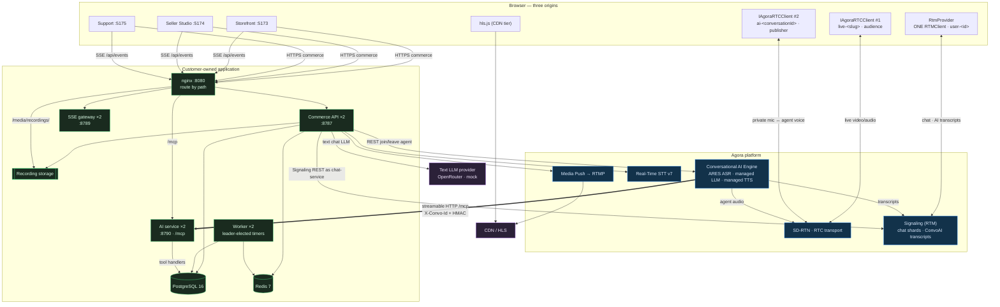
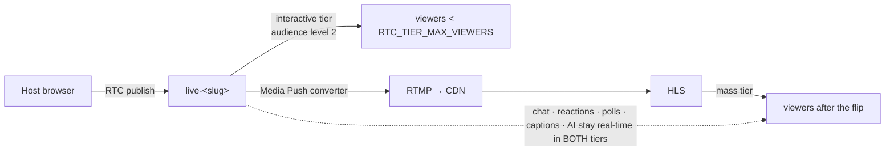

# Architecture

> **HLD:** [`hld/hld-one-page.excalidraw`](hld/hld-one-page.excalidraw) · [`hld/README.md`](hld/README.md)

## 1. What this system is

A conventional multi-category e-commerce web app that grows two real-time surfaces on top of it: **live shopping** and a **voice-first AI shopping assistant**. The commerce engine stays deliberately thin (payment and delivery-serviceability are labelled mocks); the depth goes into the Agora integration, the AI tool boundary, and the live-discount business rules.

The single most important boundary: **Agora moves media, signalling and speech; the application owns catalog, pricing, promotions, inventory, cart, orders, chat authorization and every business decision.** Agora never sees the catalog and never calls a business API directly — it calls `/mcp` for tool execution only.

## 2. Components and hops



Read the hop types off the diagram: `<-->` is media, `==>` is Agora calling back into our stack (MCP tool execution), and plain arrows are ordinary application state.

### 2.1 Three frontends, one source tree

`apps/web` holds one source tree and **three** Vite entries:

| Entry | Origin | Audience |
| ----- | ------ | -------- |
| `index.html` → `src/customer/` | :5173 | shoppers |
| `seller.html` → `src/seller/` | :5174 | hosts / sellers (Studio) |
| `support.html` → `src/support/` | :5175 | support agents |

Cross-origin links use `src/lib/origins.ts` (`customerUrl` / `sellerUrl` / `supportUrl`). The session cookie is host-scoped to `localhost` (ports ignored), so a demo login on the storefront is already signed in on Studio.

In local dev, Vite proxies `/api` and `/media` to the Commerce API on `:8787`, `/api/events` to the SSE gateway on `:8789`, and `/mcp` to the AI service on `:8790`. Docker Compose and Render put nginx in front with the same path split.

## 3. The five decisions that shape everything

### 3.1 Two RTC channels per viewer, never one

ConvoAI's agent audio must be private to one shopper, and `remote_rtc_uids` accepts exactly one user id. So the viewer is an **audience** member of `live-<slug>` and simultaneously a **publisher** in a private `ai-<conversationId>` channel. Two `IAgoraRTCClient` instances, two numeric uids, one page. While the assistant is speaking the live stream's remote audio is ducked to `setVolume(15)` and restored to 100 on stop.

### 3.2 Exactly one Signaling client per browser

`RtmProvider` owns one RTM login as `user-<id>`, with reference-counted channel subscriptions. Chat shards and the ConvoAI transcript channel share that client; `AgoraVoiceAI.init({ rtcEngine, rtmEngine })` receives the same instance.

### 3.3 Managed ConvoAI + MCP for commerce tools

Voice uses Agora's **managed** ASR, LLM, and TTS (`credential_mode: "managed"` in the join body built by `packages/agora/src/convoai.ts`). The Commerce API calls Agora's REST `POST /join`; Agora orchestrates speech end-to-end.

Commerce facts never enter a static prompt. `buildSystemPrompt()` adds session context; every price, stock level, and cart mutation goes through **MCP tools** at `${PUBLIC_API_URL}/mcp`:

```text
Browser → API: create conversation, join private RTC channel
API → Agora: POST /join with llm.mcp_servers + advanced_features.enable_tools
Agora managed LLM: plans → emits tool call
Agora → AI service /mcp: streamable HTTP with per-conversation HMAC headers
AI service → Postgres: execute tool, return structured result
Agora managed TTS: speaks the answer into the RTC channel
```

Consequences:

- The catalog stays in Postgres. Agora's managed LLM sees tool **results**, not a full product dump.
- Authentication is a **per-conversation HMAC** (`X-Convo-Id`, `X-Convo-Expires`, `X-Convo-Signature` over `<conversationId>.<expires>`), attached to every MCP request header Agora forwards.
- Tool writes are deduplicated on `(conversationId, turnId, name, argsHash)` in `packages/ai/src/toolExecutor.ts`.
- **Text chat** (degraded mode) bypasses ConvoAI and calls `LLM_PROVIDER` in-process with the same tool handlers — no Agora agent required.

`PUBLIC_API_URL/mcp` must be publicly reachable (ngrok in dev, Render URL in production). nginx pins MCP requests to one AI replica by `X-Convo-Id` / `mcp-session-id` when multiple AI replicas run behind the load balancer.

### 3.4 The 20% rule is data, and eligibility is relational

`LIVE20` is a row in `promotions` with `conditions.requiresLiveSession = true`. One pure evaluator (`packages/shared/src/promotions.ts`) decides what applies, and one resolver (`packages/domain-commerce/src/eligibility.ts::resolveLineContext`) decides _whether a line is live-eligible_, by proving four things in one query at evaluation time: the session exists, `status='live'`, the product is attached in `liveSessionProducts`, and the variant belongs to that product.

That is why the discount cannot be faked by a client, cannot survive the session ending (open carts reprice from an SSE event), and cannot leak onto an unrelated product. Changing 20% → 15% electronics-only is a `PATCH /api/admin/promotions/:id` and no redeploy.

### 3.5 Hybrid media topology, one-way



Delivery tier is **session state, not a per-join decision**. A Redis compare-and-set flips `session:<id>:deliveryTier` from `rtc` to `cdn` exactly once, when the pruned viewer count first reaches the threshold and an HLS origin is ready.

**Honest status:** with no CDN ingest available, the fallback origin is labelled `simulated-origin` in the UI, the API response and the docs. It proves the threshold, the single transition event and the client HLS handoff — it is _not_ evidence that video traversed Agora Media Push.

## 4. How state is shared between live, AI and cart

| State                          | Home                                                     | Read by                                        |
| ------------------------------ | -------------------------------------------------------- | ---------------------------------------------- |
| Session status / delivery tier | Postgres `liveSessions`, mirrored to Redis for hot reads | live room, cart eligibility, AI system message |
| Cart and pricing               | Postgres, recomputed at every read                       | cart UI, checkout, `get_cart`/`add_to_cart`    |
| Live eligibility               | derived, never stored                                    | evaluator, `get_live_offer`                    |
| Viewer presence                | Redis sorted set, pruned on read                         | tier threshold, analytics                      |
| Chat authority                 | Postgres + Redis ban/mute sets                           | `POST /chat`                                   |
| Conversation lifecycle         | Postgres `aiConversations` + Redis lease set             | admission control, sweeper                     |

Change propagation is one mechanism: **Redis pub/sub → SSE**. Clients refetch authoritative snapshots on every (re)connect.

## 5. Scale posture

| Bound                     | Number               | What we do about it                                                          |
| ------------------------- | -------------------- | ---------------------------------------------------------------------------- |
| Users per RTC channel     | 1,000,000            | interactive tier stays on RTC; mass tier goes to CDN                         |
| Project regional quota    | 10,000 PCU / 10 Gbps | the real trigger for the CDN flip; raise via Agora support                   |
| RTM channels per client   | 50                   | chat shards clamp to **49**, leaving headroom                                |
| RTM client API calls/s    | 20                   | the host subscribes to shards in paced batches (~3 s for 49)                 |
| RTM REST req/s per App ID | 500                  | server-side chat publish budget; the load profile deliberately offers ≤300/s |
| ConvoAI agents per App ID | 20 (default)         | Redis lease semaphore + labelled text fallback, never a dead end             |
| Cloud Recording           | 50 PCW / 10 QPS      | browser capture is the demonstrated path; Agora recording is behind config   |

Chat is sharded (`chat-<slug>-<shardIndex>`, `sha256(userId) % chatShardCount`) with the shard count **frozen at go-live** from `expectedPeakViewers`. High-frequency signals aggregate at 1 Hz from the leader-elected worker.

## 6. Failure isolation

- **Side services are independent of the session.** Recording, RTT and Media Push each carry their own status column. A failure there marks itself and never rolls back a working RTC session.
- **Transitions are conditional and idempotent.** `UPDATE … WHERE status = <expected> RETURNING` means only one request out of ten concurrent `start`s starts each side service exactly once.
- **Payment is outside the transaction.** Pre-authorization runs before the stock transaction opens, so no row lock is ever held across its latency.
- **Webhooks are not load-bearing.** The ConvoAI lease sweeper remains primary; webhooks only accelerate.
- **Observability crosses vendors.** AI paths add `conversationId`, `agoraAgentId`, `channel` and `provider` to every log line.
