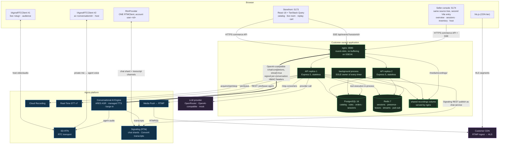
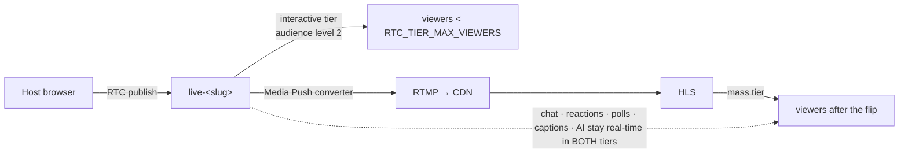

# Architecture

> **Interview HLD:** [`hld/hld-one-page.excalidraw`](hld/hld-one-page.excalidraw)
> (editable) and [`hld/hld-one-page.svg`](hld/hld-one-page.svg) (preview).
> The one-page view shows the client, load-balancing, stateless API, data, worker,
> Agora, AI-provider and CDN boundaries plus visible capacity arithmetic. Verify the
> checked-in preview with `python3 scripts/make-hld-diagrams.py`.

## 1. What this system is

A conventional multi-category e-commerce web app that grows two real-time surfaces on top of it: **live shopping** and a **voice-first AI shopping assistant**. The commerce engine stays deliberately thin (payment and delivery-serviceability are labelled mocks); the depth goes into the Agora integration, the AI tool boundary, and the live-discount business rules.

The single most important boundary: **Agora moves media, signalling and speech; the application owns catalog, pricing, promotions, inventory, cart, orders, chat authorization and every business decision.** Agora never sees the catalog and never calls a business API directly.

## 2. Components and hops

Read the hop types off the diagram: `<-->` is media, `<-->` into Signaling is messaging, `==>` is the inverted control flow that makes the AI safe (Agora calls _us_), and plain arrows are ordinary application state.

### 2.1 Two frontends, one source tree

The browser tier is **two applications on two origins**, not one app with role-gated routes. `apps/web` holds one source tree and two Vite entries: `index.html → src/customer/` serves the customer storefront on **:5173**, `seller.html → src/seller/` serves the seller console on **:5174**. Two audiences, two dashboards, two deploy cadences — a shopper never downloads console code, and the console can be shipped or firewalled independently. Everything genuinely shared (`lib/`, `state/session.tsx`, `realtime/`, `hooks/`, the AI dock, the presentational components) stays in place and is imported by both, so there is still exactly one API client, one Signaling provider and one promotion-display path.

The console's routes are rebased onto its own origin; every route belongs to the seller panel:

| Path on :5174                 | Surface                                                      |
| ----------------------------- | ------------------------------------------------------------ |
| `/`                           | seller overview and analytics                                |
| `/shows`, `/shows/:id/report` | show list and per-show analytics                             |
| `/catalog`, `/catalog/new`    | inventory and product creation                               |
| `/orders`, `/payouts`         | commerce operations                                          |
| `/audience`                   | moderation log                                               |
| `/live/:slug/preflight`       | device and source check                                      |
| `/live/:slug`                 | host console — publish, pin, polls, moderate, share products |

Neither app is served by nginx: nginx :8080 is the API front door, and each dev server proxies `/api` and `/media` to it, so both apps call the same relative paths and CORS stays a list of two exact origins (`WEB_ORIGIN=http://localhost:5173,http://localhost:5174`, split on commas in `app.ts`). Authorization is unaffected by the split — the guards live on the server, and the split is only about who downloads which bundle. Identity is shared for free: the session cookie is host-scoped to `localhost` and cookies ignore the port, so signing in on the storefront is already signed in on the console. Cross-origin navigation between the two must therefore be a real `<a href>` built by `src/lib/origins.ts` (`customerUrl` / `sellerUrl`, overridable with `VITE_CUSTOMER_ORIGIN` / `VITE_SELLER_ORIGIN`); a router `<Link>` would only rewrite the path on the origin you are already on.

## 3. The five decisions that shape everything

### 3.1 Two RTC channels per viewer, never one

ConvoAI's agent audio must be private to one shopper, and `remote_rtc_uids` accepts exactly one user id. So the viewer is an **audience** member of `live-<slug>` and simultaneously a **host** in a private `ai-<conversationId>` channel. Two `IAgoraRTCClient` instances, two numeric uids, one page. While the assistant is speaking the live stream's remote audio is ducked to `setVolume(15)` and restored to 100 on stop — which is what "private voice conversation while still tuned into the Live Stream" actually requires.

### 3.2 Exactly one Signaling client per browser

Agora documents one Signaling client instance per app/client. `RtmProvider` owns it: one login as the stable account `user-<id>`, token renewal on `tokenPrivilegeWillExpire`, and **reference-counted** subscriptions. Chat and the ConvoAI transcript channel are two subscriptions on that single client, and it is the same instance handed to `AgoraVoiceAI.init({ rtcEngine, rtmEngine })`. Stopping the assistant releases only the AI channel; chat and the login survive.

### 3.3 Agora's "LLM" is our own backend

`llm.vendor:"custom"` points at `${PUBLIC_API_URL}/api/ai/convo/{conversationId}/chat/completions`. Agora streams an OpenAI-compatible request to us; we own the tool list, execute tools in-process against the commerce domain, and stream back only assistant text. Consequences:

- The catalog never leaves the application. No prompt contains a price that could go stale.
- Authentication is a **per-conversation HMAC** (`X-Convo-Expires` + `X-Convo-Signature` over `<conversationId>.<expires>`), not a global shared secret. A leaked signature is scoped to one conversation and expires.
- Tool results are deduplicated on `(conversationId, turnId, name, argsHash)` — deliberately **not** on `toolCallId`, because a retried callback re-runs the model and mints a fresh id, which would dedupe nothing.
- The OpenAI message contract is respected exactly: the complete assistant message with its ordered `tool_calls` is appended **before** any `{role:'tool'}` result.

### 3.4 The 20% rule is data, and eligibility is relational

`LIVE20` is a row in `promotions` with `conditions.requiresLiveSession = true`. One pure evaluator (`packages/shared/src/promotions.ts`) decides what applies, and one resolver (`domain/eligibility.ts::resolveLineContext`) decides _whether a line is live-eligible_, by proving four things in one query at evaluation time: the session exists, `status='live'`, the product is attached in `liveSessionProducts`, and the variant belongs to that product. Prices are always read from `productVariants`; `cartItems.unitPriceMinorUnits` is a display snapshot and never authoritative.

That is why the discount cannot be faked by a client, cannot survive the session ending (open carts reprice from an SSE event), and cannot leak onto an unrelated product. Changing 20% → 15% electronics-only is a `PATCH /api/admin/promotions/:id` and no redeploy.

### 3.5 Hybrid media topology, one-way

Delivery tier is **session state, not a per-join decision**. A Redis compare-and-set flips `session:<id>:deliveryTier` from `rtc` to `cdn` exactly once, when the pruned viewer count first reaches the threshold and an HLS origin is ready; the winner publishes `session.delivery_tier_changed`; clients start HLS **before** leaving the RTC channel; it never flips back. That removes threshold oscillation entirely. Prototype threshold is 3 so three tabs demonstrate it; production is derived from the project's 10,000 PCU / 10 Gbps regional quota.

**Honest status:** with no CDN ingest available, the fallback origin is labelled `simulated-origin` in the UI, the API response and the docs. It proves the threshold, the single transition event and the client HLS handoff — it is _not_ evidence that video traversed Agora Media Push.

## 4. How state is shared between live, AI and cart

There is no shared client state. Every surface reads the same server truth:

| State                          | Home                                                     | Read by                                        |
| ------------------------------ | -------------------------------------------------------- | ---------------------------------------------- |
| Session status / delivery tier | Postgres `liveSessions`, mirrored to Redis for hot reads | live room, cart eligibility, AI system message |
| Cart and pricing               | Postgres, recomputed at every read                       | cart UI, checkout, `get_cart`/`add_to_cart`    |
| Live eligibility               | derived, never stored                                    | evaluator, `get_live_offer`                    |
| Viewer presence                | Redis sorted set, pruned on read                         | tier threshold, analytics                      |
| Chat authority                 | Postgres + Redis ban/mute sets                           | `POST /chat`                                   |
| Conversation lifecycle         | Postgres `aiConversations` + Redis lease set             | admission control, sweeper                     |

Change propagation is one mechanism: **Redis pub/sub → SSE**. One subscriber connection per API process (never one per browser), reference-counted per user/session channel, plus a permanent `events:global` for rule changes. Because pub/sub and SSE offer no replay, clients refetch authoritative snapshots on every (re)connect rather than assuming they missed nothing.

## 5. Scale posture

| Bound                     | Number               | What we do about it                                                          |
| ------------------------- | -------------------- | ---------------------------------------------------------------------------- |
| Users per RTC channel     | 1,000,000            | interactive tier stays on RTC; mass tier goes to CDN                         |
| Project regional quota    | 10,000 PCU / 10 Gbps | the real trigger for the CDN flip; raise via Agora support                   |
| RTM channels per client   | 50                   | chat shards clamp to **49**, leaving headroom                                |
| RTM client API calls/s    | 20                   | the host subscribes to shards in paced batches (~3 s for 49)                 |
| RTM REST req/s per App ID | 500                  | server-side chat publish budget; the load profile deliberately offers ≤300/s |
| ConvoAI agents per App ID | 20 (default)         | Redis lease semaphore + labelled text fallback, never a dead end             |
| Cloud Recording           | 50 PCW / 10 QPS      | browser capture is the demonstrated path; Agora recording is behind config   |

Chat is sharded (`chat-<slug>-<shardIndex>`, `sha256(userId) % chatShardCount`) with the shard count **frozen at go-live** from `expectedPeakViewers`, so a viewer never gets re-routed mid-session. High-frequency signals (reactions, poll votes) are aggregated server-side and broadcast at 1 Hz from the single background process — per-tap fan-out would be the largest RTM cost line at scale, and two API replicas would otherwise double-emit.

## 6. Failure isolation

- **Side services are independent of the session.** Recording, RTT and Media Push each carry their own status column. A failure there marks itself and never rolls back a working RTC session.
- **Transitions are conditional and idempotent.** `UPDATE … WHERE status = <expected> RETURNING` means only one request out of ten concurrent `start`s starts each side service exactly once.
- **Payment is outside the transaction.** Pre-authorization runs before the stock transaction opens, so no row lock is ever held across its latency. A real provider replaces it with authorize → reserve → capture/void plus an expiry reconciler; a database rollback cannot undo an external charge and we do not pretend otherwise.
- **Webhooks are not load-bearing.** Agora states NCS delivery is not guaranteed, so the ConvoAI lease sweeper and Cloud Recording `query` polling remain primary; webhooks only accelerate.
- **Observability crosses the three vendors.** Every log line carries `requestId`; AI paths add `conversationId`, `agoraAgentId`, `channel` and `provider`, so one failure can be traced across Agora Console / Call Inspector, the AI provider and our own services. Prometheus metrics cover tool calls, agent slots, promotion applications, provider latency, chat publishes, moderation actions and analytics backlog.
