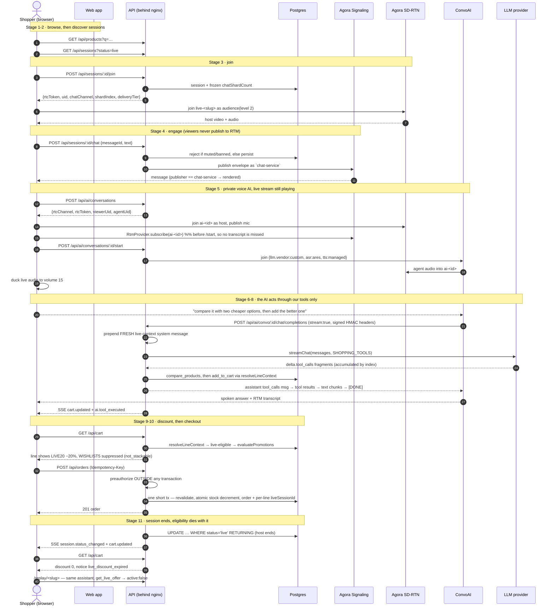
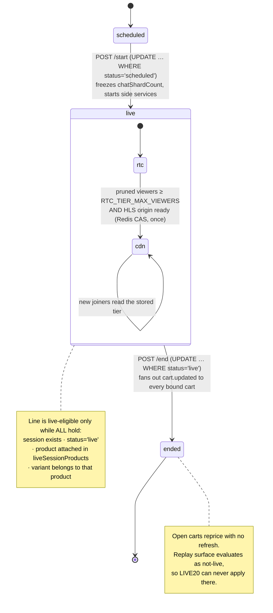

# Customer journey

The assignment defines eleven stages. Each one below names the concrete UI/API behaviour that implements it and the demo step that observes it (`M2`…`M22` are the manual verification steps in `LIVE_COMMERCE_PLATFORM_PLAN.md`).

| #   | Stage         | What actually happens                                                                                                           | Observed by |
| --- | ------------- | ------------------------------------------------------------------------------------------------------------------------------- | ----------- |
| 1   | Browse        | Category rails, facet listing, `to_tsvector` search, PDP with variant-level price/stock                                         | M2          |
| 2   | Discover Live | `/live` renders Upcoming / Live now / Watch again from `GET /api/sessions?status=`                                              | M4          |
| 3   | Join          | `POST /api/sessions/:id/join` returns RTC identity + the stored delivery tier; 10 s presence heartbeat                          | M5          |
| 4   | Engage        | Chat via `POST /api/sessions/:id/chat` (server-mediated), 1 Hz reaction aggregates, polls, pinned product cards                 | M6          |
| 5   | Ask AI        | Second RTC client on `ai-<conversationId>`; the agent joins; live audio ducks to volume 15                                      | M9          |
| 6   | Compare       | `compare_products` over the real catalog, rendered in the AI panel and the comparison drawer                                    | M10         |
| 7   | Check         | `check_delivery`, `get_payment_options` (the same function checkout calls), current price + `get_live_offer`                    | M11         |
| 8   | Buy           | `add_to_cart` through `resolveLineContext`, deduplicated by `aiToolCalls`                                                       | M13         |
| 9   | Discount      | `LIVE20` applies only while the line is live-eligible; the saving is stated in the UI _and_ spoken, and volunteered proactively | M13, M9     |
| 10  | Checkout      | Policy validation → pre-authorization → one short stock transaction → order with per-line attribution                           | M17         |
| 11  | Replay        | Browser-recorded video, searchable transcript, summary — and `get_live_offer` returns `active:false`, so `LIVE20` cannot apply  | M18, M19    |

## The core sequence

## The state machine behind stage 9 → 11

## Degraded paths the journey still survives

| Failure                                | What the shopper sees                                       | Why the journey continues                                                                |
| -------------------------------------- | ----------------------------------------------------------- | ---------------------------------------------------------------------------------------- |
| ConvoAI at capacity (20 agents/App ID) | "Voice agents at capacity — using text assist (degraded)"   | identical tool executor over a non-streaming JSON transport                              |
| No CDN ingest configured               | "CDN tier (simulated-origin)" badge                         | the tier transition and HLS handoff still demonstrate; Media Push is labelled unverified |
| No storage bucket                      | replay plays the browser `MediaRecorder` capture            | Cloud Recording stays behind config, contract-tested only                                |
| `MediaRecorder` mime unsupported       | explicit "cannot record in this browser" state              | the UI never claims a recording it does not have                                         |
| Signaling REST publish unavailable     | chat still persists and arrives over SSE, labelled degraded | moderation authority lives in `POST /chat`, not in the transport                         |
| Session ends mid-checkout              | `409 pricing_changed` with the new totals, re-confirm       | pre-authorization is voided; no order at a stale price                                   |
